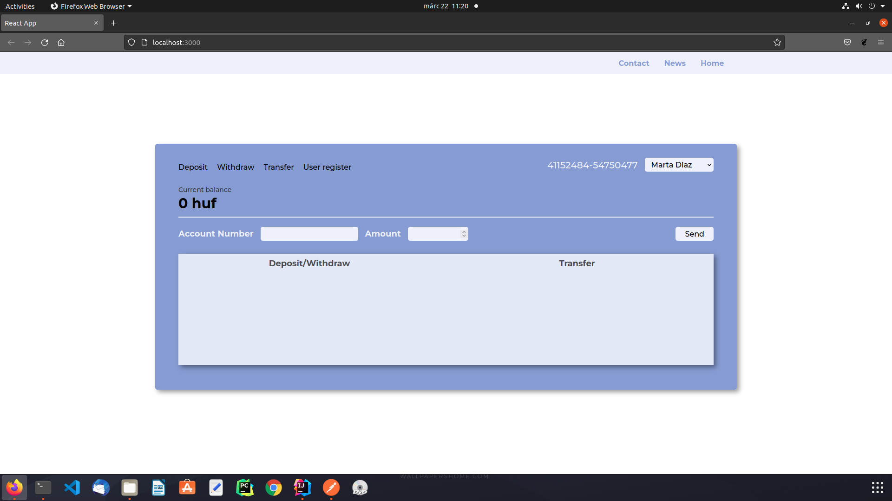
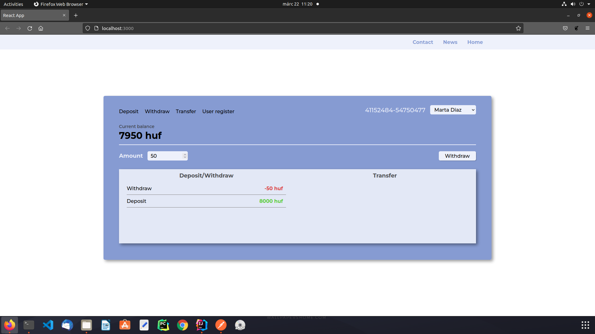
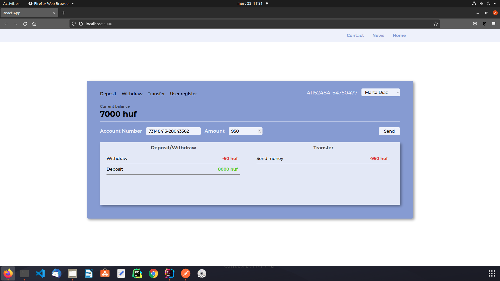
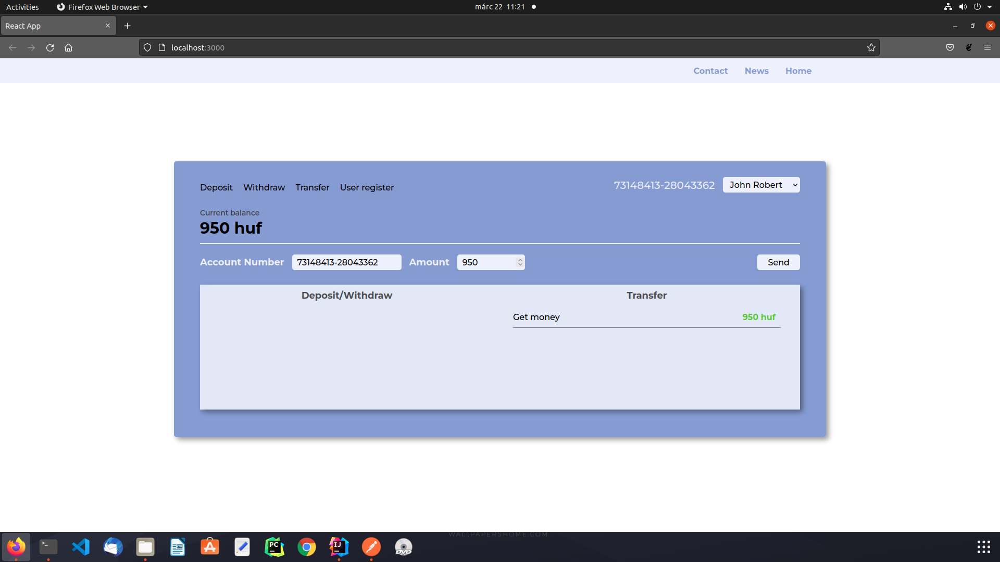
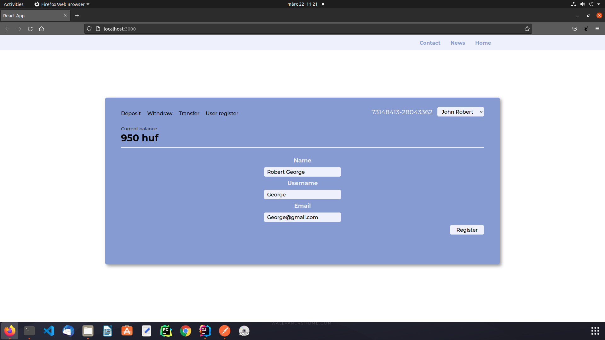
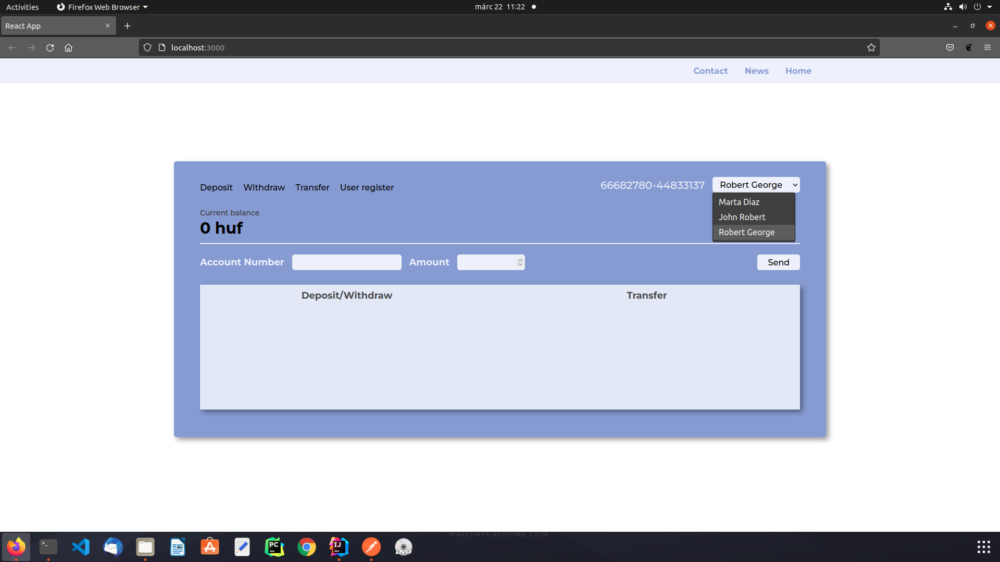

# Homework

In this project I created a REST api backend with java spring and PSQL database.\
All endpoints I used JSON data structure for data transfer.\
I used my own exceptions for handle invalid/wrong request.\
I used MVC design pattern, and JPA for database access.\
For all transaction I validate the account with the account number which is unique.

####My backend can hanlde:
- invalid/wrong account number
- invalid/wrong transaction value
- invlaid transfer for same account number
- invalid withdraw

###Bakckend transaction endpoints
- /api/transaction/deposit
- /api/transaction/withdraw
- /api/transaction/transfer
- /api/transaction/history/account

###Bakckend account endpoints
- /api/account/register
- /api/account/search
- /api/account/list

###Basic frontend design
####Empty account

####Deposit money

####Withdraw money

####Transef money

####Account get the transfer

####Register new account

####We can switch between account

